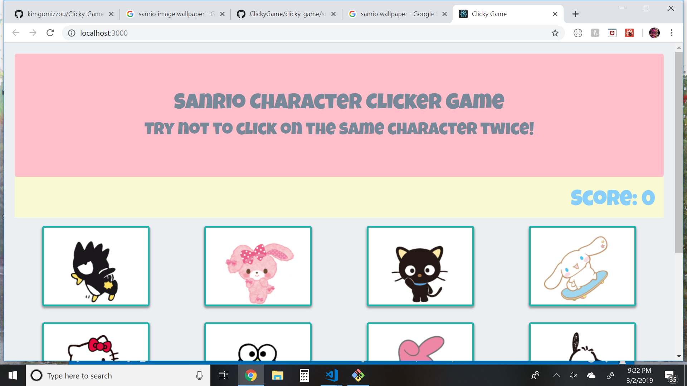

# ClickyGame

Sanrio Character Clicker Game is a memory game that was built using React, Bootstrap and ES6.  The application's UI is broken into 4 components.  The object of the game is to not click on the same character twice.

